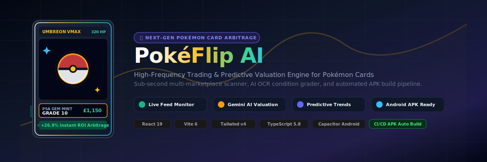

<p align="center">
  
</p>

<p align="center">
  
</p>

<h1 align="center">PokéFlip AI</h1>

<p align="center">
  <strong>High-Frequency Trading, Real-Time Arbitrage &amp; Predictive Valuation Engine for Pokémon Cards</strong>
</p>

<p align="center">
  <a href="https://github.com/features/actions"></a>
  <a href="https://react.dev"></a>
  <a href="https://vitejs.dev"></a>
  <a href="https://tailwindcss.com"></a>
  <a href="https://capacitorjs.com"></a>
  <a href="./LICENSE"></a>
</p>

---

## ⚡ Executive Summary

**PokéFlip AI** is an enterprise-grade fintech platform built for high-volume Pokémon card traders, investors, and hobbyist flippers. By monitoring sub-second listing streams across 7 major marketplaces (*eBay, TCGplayer, Cardmarket, Whatnot, Mercari, Facebook Marketplace, Local Shows*), PokéFlip AI calculates net flip profit margins after platform fees, taxes, shipping costs, and liquidity risks in real time.

Powered by **Google Gemini 2.5 Flash Vision OCR**, traders can snap or upload a card photo for instant visual condition analysis, population report lookups, and algorithmic future-value price projections.

---

## 🌟 Key Features

| Feature | Description |
| :--- | :--- |
| **⚡ Sub-Second Feed Monitor** | Scans live marketplaces for underpriced raw and graded slabs. Calculates net ROI, risk scores, and estimated turnover days. |
| **🤖 Gemini AI OCR & Scanner** | Upload card photos for instant computer vision grade estimation, centering verification, and market target valuation. |
| **💱 Multi-Currency Support** | View analytics in both **USD ($)** and **GBP (£)** with live exchange rate conversions. |
| **📊 Predictive Value Projections** | Multi-scenario Monte Carlo future value models (Base, Bull, Bear) with confidence bands and historical volatility metrics. |
| **📦 Carrier Logistics & QR Labels** | Generate automated packing slips, track USPS/FedEx/UPS shipments, and print carrier QR shipping labels. |
| **🔐 Passkey Protected Vault** | Manage portfolio stock, cost basis, realized gains, and team syndicate access control with biometric security. |
| **📱 Native Android Mobile APK** | Fully integrated with Capacitor for native mobile deployment and automated GitHub Actions APK builds. |

---

## 🗺️ System Architecture

```
                                  PokéFlip AI Architecture
                                  
  ┌──────────────────────────────────────────────────────────────────────────────────────┐
  │                                    REACT 19 FRONTEND                                 │
  │                                                                                      │
  │  ┌──────────────────┐  ┌──────────────────┐  ┌──────────────────┐  ┌──────────────┐  │
  │  │ Live Deal Engine │  │ Market Analytics │  │ Gemini AI Scanner│  │ Vault Manager│  │
  │  └────────┬─────────┘  └────────┬─────────┘  └────────┬─────────┘  └──────┬───────┘  │
  └───────────┼─────────────────────┼─────────────────────┼───────────────────┼──────────┘
              │                     │                     │                   │
  ┌───────────▼─────────────────────▼─────────────────────▼───────────────────▼──────────┐
  │                                  EXPRESS SERVER + VITE                               │
  │                                                                                      │
  │  ┌──────────────────────┐  ┌──────────────────────────┐  ┌─────────────────────────┐ │
  │  │   /api/gemini/scan   │  │  /api/market/analytics   │  │  /api/fulfillment/label │ │
  │  └──────────┬───────────┘  └────────────┬─────────────┘  └────────────┬────────────┘ │
  └─────────────┼───────────────────────────┼─────────────────────────────┼──────────────┘
                │                           │                             │
  ┌─────────────▼─────────────┐   ┌─────────▼───────────────┐   ┌─────────▼──────────────┐
  │ Google Gemini 2.5 Vision  │   │  PokéFlip Market Engine │   │ Capacitor Mobile APK   │
  └───────────────────────────┘   └─────────────────────────┘   └────────────────────────┘
```

---

## 🚀 Quick Start & Installation

### Prerequisites

- **Node.js**: `v20.x` or higher
- **NPM**: `v10.x` or higher
- **Java JDK**: `17` (Required for building Android APK locally)

### 1. Clone Repository

```bash
git clone https://github.com/your-username/pokeflip-ai.git
cd pokeflip-ai
```

### 2. Install Dependencies

```bash
npm install
```

### 3. Environment Variables Setup

Create a `.env` file in the root directory (or copy from `.env.example`):

```env
# Gemini API Key for server-side AI card valuation
GEMINI_API_KEY=your_gemini_api_key_here

# Server Port Configuration
PORT=3000
```

### 4. Run Development Server

```bash
npm run dev
```

Open your browser at `http://localhost:3000`.

---

## 📱 Mobile APK Build & GitHub Actions CI/CD

This repository features an automated **GitHub Actions CI/CD pipeline** (`.github/workflows/build-apk.yml`) that compiles and deploys an **unsigned Android APK** on every commit or release tag!

### How Automated Build Works:

1. **Trigger**: Push code to `main` branch or create a release tag (e.g. `v1.0.0`).
2. **Environment Setup**: Runs on `ubuntu-latest`, initializes Node 20 and JDK 17.
3. **Verification**: Executes `tsc --noEmit` linter and builds static Vite assets.
4. **Capacitor Sync**: Bundles web assets into the Android native Capacitor project (`npx cap sync android`).
5. **Gradle Compile**: Compiles debug/unsigned APK via `./gradlew assembleDebug`.
6. **Artifact Output**: Uploads `app-debug.apk` as a downloadable GitHub Action Artifact and attaches it to the GitHub Release.

### Local APK Build Command

To build the Android APK manually on your workstation:

```bash
# Build Vite production assets
npm run build

# Sync web assets to Capacitor Android
npx cap add android
npx cap sync android

# Build debug APK via Gradle
cd android
./gradlew assembleDebug
```

The compiled APK will be located at:
`android/app/build/outputs/apk/debug/app-debug.apk`

---

## 🛠️ Project Directory Structure

```
.
├── .github/
│   └── workflows/
│       └── build-apk.yml           # GitHub Actions Automated APK Pipeline
├── public/
│   ├── app-icon.svg                # High-res vector app icon
│   └── github-banner.svg           # Artwork GitHub banner
├── src/
│   ├── components/
│   │   ├── AiValuationScanner.tsx  # Gemini OCR & visual grade scanner
│   │   ├── HeaderNavbar.tsx        # Top navigation & system status
│   │   ├── LiveDealScanner.tsx     # Real-time arbitrage feed monitor
│   │   ├── MarketAnalytics.tsx     # Multi-timeframe charts & GBP (£) engine
│   │   ├── NavigationTabs.tsx      # Main application tab switcher
│   │   ├── PokeBotAssistant.tsx    # AI trading copilot chatbot
│   │   ├── PortfolioManager.tsx    # Inventory vault & cost basis tracking
│   │   ├── ShippingFulfillment.tsx # Packing slips & QR label generator
│   │   ├── SmartAlertsView.tsx     # Push/SMS price alert triggers
│   │   └── TeamWorkspaceView.tsx   # Multi-user syndicate & Passkey vault
│   ├── data/
│   │   └── mockPokemonData.ts      # Authentic Pokémon card dataset & fees
│   ├── lib/
│   │   └── geminiApi.ts            # Gemini 2.5 Flash SDK integration
│   ├── App.tsx                     # Main application container
│   ├── main.tsx                    # React entry point
│   └── types.ts                    # TypeScript interface declarations
├── capacitor.config.json           # Capacitor mobile configuration
├── package.json                    # Project dependencies & build scripts
├── server.ts                       # Express + Vite server entry point
├── tsconfig.json                   # TypeScript configuration
└── vite.config.ts                  # Vite build configuration
```

---

## 📄 License

Distributed under the **MIT License**. See [`LICENSE`](./LICENSE) for more information.

---

<p align="center">
  Crafted with ❤️ for Pokémon Card Traders &amp; Collectors Worldwide.
</p>
